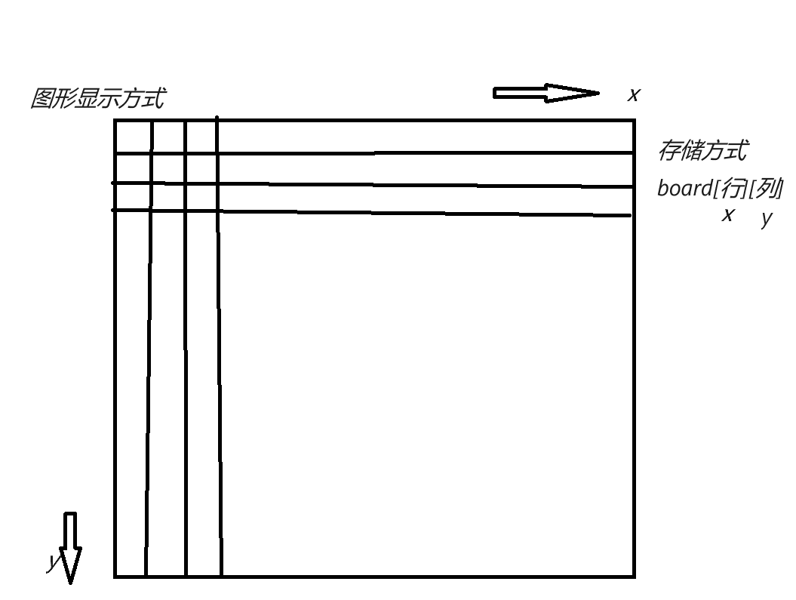

注意区分图形显示中的x是横坐标，而数组中我们把x当作行，y当作列

#### 平台

##### 安卓端（暂时不管）

使用android studio

##### 桌面端

###### 图形界面

采用java.awt，简单的图形即可，

棋盘：可以用图片或者绘图

棋子：贴图或者绘图

相应用户的点击操作

##### web端（暂时不管）

（擅长web前端的同学可以试试）

图形界面不应该跟具体的游戏绑死，应该保留调用接口(例如绘制棋盘，响应用户输入这些)，用户选择具体的一个游戏时动态装配

#### 网络通信

##### 局域网游玩

通过输入对方ip地址(最好是能够局域网查找)

##### 连接服务器

每多一个对局服务器就开一个线程。注意配置信息(比如服务器ip或者域名，端口这些要以配置文件形式存放在项目一个文件里边)，游戏双方可以看到对方的头像，用户名，游戏场数，游戏胜率信息

##### 并发要求

服务器端的需要支持多人在线同时游玩

#### 数据存储

##### 本地

无论用户是否勾选记住密码，只要用户一登陆，用户所选择的图片，用户名，密码数据将会以文件形式存储在本地，同时系统会为其存储一个唯一的编号id。而且每次对战后将会按照游戏类型更新游戏场数，积分，胜利场数，胜率信息。

##### 服务器（暂时不管）

运用JDBC，采用mysql数据库存储

用户名，密码，玩家胜率，每种棋的游玩场数，有余力可以在此基础上加个段位系统

#### 游戏种类

五子棋

黑白棋

围棋(规则过于复杂，有时间再尝试)

#### 流程

首页应该有注册和登录功能，其中注册因为咱现在还不用数据库，所以首次登录就算是注册，第二次登录不用选择头像。还有个记住密码的复选框(如果勾选下次打开应用时应该是自己填充好了的)，以及一个局域网游玩的入口(局域网下的游玩不用输用户名，也不算入胜率)

登录成功后，玩家先选择棋类，然后进入对应的大厅，会列出一个房间列表(有序)以供玩家进行选择(就类似qq游戏大厅那样)，进入房间后玩家需要点击准备，双方都准备后游戏开始，游戏过程中玩家可以点认输，此时对方获胜。每当对局结束系统会更新玩家数据，并回到玩家选择是否准备的阶段

余期望通过跟踪大家的进度和不断的及时的调整代码结构以实现代码复用的最大化